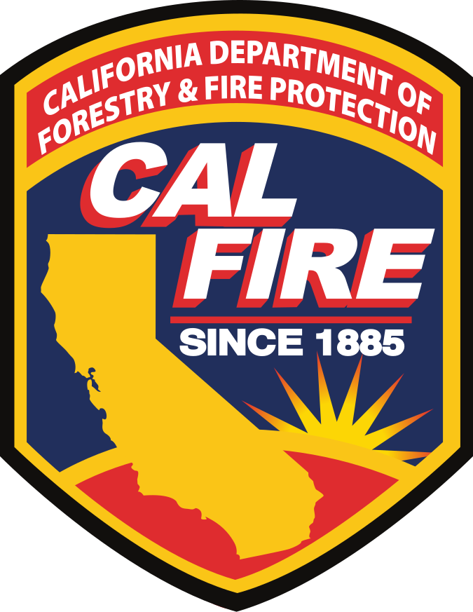

# Funding Analysis

**Forest, Fire, and Wood Business**
Analysis of CAL FIRE's Business and Workforce Development Grants

Vance Russell | Forest Business Alliance

## Summary
The initial analysis of CAL FIRE's Business and Workforce Development Grants found the following:

- The top 10 grant-receiving counties were Tuolumne, Shasta, Yolo, Placer, Tulare, Siskiyou, Humboldt, Plumas, Fresno, and Mariposa Counties. 
- Every county had projects that requested funds but Merced, Los Angeles, Inyo, Colusa, DelNorte, Orange, Kern, Riverside, Kings, and Monterey counties had not received funding as of November 2023.
- The largest proportion of grants awarded in November 2023 went to Northern California, with 80% going to the North Coast (19%) and Sierra Cascade (61%) regions. The Central Coast (3%) and Southern California (1%) were far behind. The total requested mirrors these percentages by region, although they are slightly higher for the Central Coast (4%) and Southern California (3%).
- The counties with the highest grant success rate (% successfully funded) were Sutter, Stanislaus, San Mateo, Santa Clara, Solano, Siskiyou, Sacramento, Nevada, Mariposa, and Alpine counties. However, a bivariate analysis examining requested and awarded amounts showed that the most successful counties (high amount awarded by the low amount requested) were Ventura, Alpine, San Francisco, Sacramento, and Sutter Counties.
- To increase the analysis accuracy, more precise project location is needed. Further analysis by regions with the most need, e.g., disadvantaged communities, fire probability, or underinvestment, is also needed.

[The Forest Business Alliance](https://www.forestbusinessalliance.org/) provides technical assistance, workshops, and a peer-learning network to increase local and regional capacity for California wood products and forest health. Funding for this project is provided by CAL FIRE's [Business and Workforce Development Grants](https://www.youtube.com/watch?v=ycVSe4K3EZQ).

[CAL FIRE's Wood Products and Bioenergy Program](https://www.fire.ca.gov/what-we-do/natural-resource-management/environmental-protection-program/wood-products-and-bioenergy) manages the BWD grants and works to maintain and enhance California's wood products infrastructure to support healthy, resilient forests and the people and ecosystems that depend on them.

## Fire
Climate change and more than a century of fire suppression have created forced foreste ecosystems well outside their natural conditions. Prior to European settlement, fires were common throughout California, used as a tool for managing food, game, disease, and community safety by Tribal communities with as many as 4 million acres/yr burning throughout the state.

However, in the present, severe wildfires, negatively affecting communities and ecosystems, have burned (red areas of map) much of the state in the past several decades.

Some areas have burned multiple times. The bright red area southeast of Lake Berryessa, along highway 128, is the most frequently burned area in California.

In other regions, large wildfires created devastating consequences. The 2018 Camp Fire (click on Paradise in the lower center of map) killed 85 people and destroyed Paradise. Three years later, the Dixie Fire (click to the west or left of Lake Almanor) burned nearly 1 million acres and caused $1.15 billion in damage.

The multitude of fires starting in the early 2000s built a wealth of support for forest health projects to thin unhealthy forest stands and reintroduce fire into forested ecosystems. Those projects created a lot of wood, especially small-diameter wood, without markets. 

CAL FIRE responded by supporting the creation and expansion of wood products and bioenergy businesses and organizations focused on processing this wood. The Forest Business Alliance conducted an initial study on where the funds went to analyze patterns and identify areas of potential future need or funding focus.